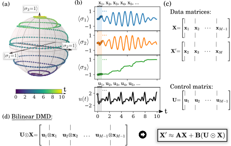

# Bilinear Dynamic Mode Decomposition for Quantum Control

https://arxiv.org/abs/2010.14577

_**Andy Goldschmidt**, Eurika Kaiser, Jonathan L. Dubois, Steven L. Brunton, J. Nathan Kutz_

Data-driven methods for establishing quantum optimal control (QOC) using time-dependent control pulses tailored to specific quantum dynamical systems and desired control objectives are critical for many emerging quantum technologies. We develop a data-driven regression procedure, bilinear dynamic mode decomposition (biDMD), that leverages time-series measurements to establish quantum system identification for QOC. The biDMD optimization framework is a physics-informed regression that makes use of the known underlying Hamiltonian structure. Further, the biDMD can be modified to model both fast and slow sampling of control signals, the latter by way of stroboscopic sampling strategies. The biDMD method provides a flexible, interpretable, and adaptive regression framework for real-time, online implementation in quantum systems. Further, the method has strong theoretical connections to Koopman theory, which approximates non-linear dynamics with linear operators. In comparison with many machine learning paradigms, it requires minimal data and the biDMD model is easily updated as new data is collected. We demonstrate the efficacy and performance of the approach on a number of representative quantum systems, showing that it also matches experimental results.

## Project description
* **Examples.ipynb** contains a Jupyter notebook with Python code to reproduce the figures in the paper and more.
* There are comments in the notebook to help guide the reader through the examples.
* Nonstandard external packages that are required to run the notebook are [dmdlab](https://dmdlab.readthedocs.io/en/latest/) for the main algorithm and the [QuTiP](http://qutip.org/) for quantum simulations.
* Please feel free to message me if you have any questions or feedback.

## License
Copyright 2021 Andy Goldschmidt

Permission is hereby granted, free of charge, to any person obtaining a copy of this software and associated documentation files (the "Software"), to deal in the Software without restriction, including without limitation the rights to use, copy, modify, merge, publish, distribute, sublicense, and/or sell copies of the Software, and to permit persons to whom the Software is furnished to do so, subject to the following conditions:

The above copyright notice and this permission notice shall be included in all copies or substantial portions of the Software.

THE SOFTWARE IS PROVIDED "AS IS", WITHOUT WARRANTY OF ANY KIND, EXPRESS OR IMPLIED, INCLUDING BUT NOT LIMITED TO THE WARRANTIES OF MERCHANTABILITY, FITNESS FOR A PARTICULAR PURPOSE AND NONINFRINGEMENT. IN NO EVENT SHALL THE AUTHORS OR COPYRIGHT HOLDERS BE LIABLE FOR ANY CLAIM, DAMAGES OR OTHER LIABILITY, WHETHER IN AN ACTION OF CONTRACT, TORT OR OTHERWISE, ARISING FROM, OUT OF OR IN CONNECTION WITH THE SOFTWARE OR THE USE OR OTHER DEALINGS IN THE SOFTWARE.
